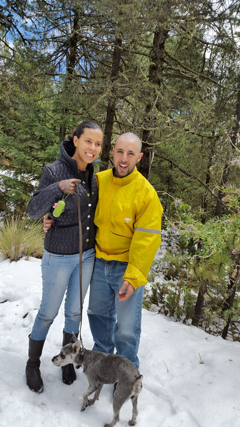

I am Federico Ramallo a Web developer turned CTO at [Tangosource](http://tangosource.com).

## Mentor

* As CTO of Tangosource I trained more than 50 developers from trainees to senior developers
* At crowd interactive I moved to Mexico, mentored new recruits and build a team of developers

## Presentations

* [Going Pro - 2015](https://docs.google.com/presentation/d/1VJPXj6UPEsszSQVB7UnB5oAyN1mWLJ6nsrIM8rzs644/edit?usp=sharing)
* [Couch DB a NoSQL database - 2011](http://www.slideshare.net/rubycslides/couchdb-a-nosql-database)

## Web developer

<a class="github-button" href="https://github.com/framallo" data-style="mega" data-count-href="/framallo/followers" data-count-api="/users/framallo#followers" data-count-aria-label="# followers on GitHub" aria-label="Follow @framallo on GitHub">Follow @framallo</a>

I have 8+ years of experience in Rails and a couple of repositories on [Github](https://framallo.com/github)

## Connect with me

I would love to hear from you, so you should contact me on the web

* [Twitter](http://twitter.com/framallo)
* [Github](https://github.com/framallo)
* [Facebook](https://www.facebook.com/federico.ramallo.94)
* [Linkedin](https://mx.linkedin.com/in/framallo)





## About

I was born in Buenos Aires, Argentina. In 2009 I moved to mexico and got married in 2012.

### License

[solo by Shu Uesugi](https://github.com/chibicode/solo) [MIT License](http://chibicode.mit-license.org/)
